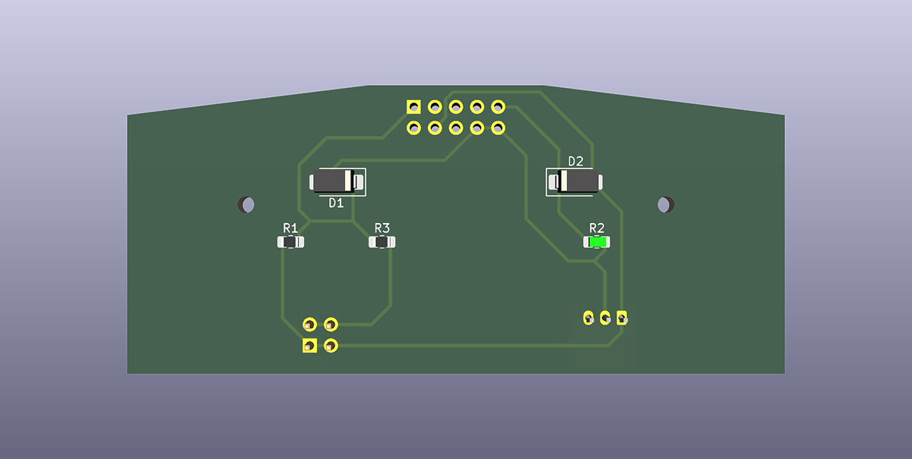
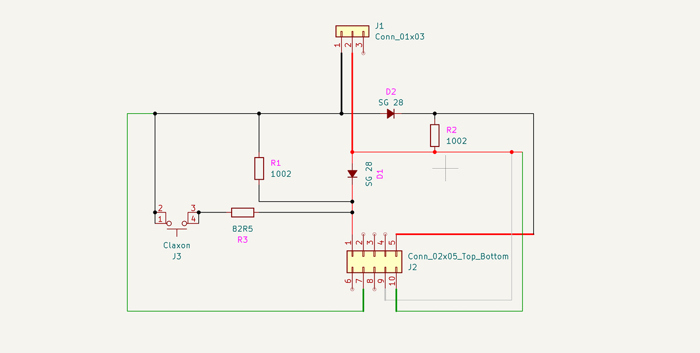

# Модуль управления рулевым колесом для Mercedes-Benz W203




Данный проект представляет собой разработку специализированного электронного модуля управления рулевым колесом, предназначенного для обеспечения функциональной совместимости рулевых колёс более новых поколений автомобилей Mercedes-Benz в платформу W203.

В основе разработки лежат результаты измерений электрических параметров оригинального рулевого колеса W203, а также выполненный обратный инженерный анализ его электрической структуры. Полученные данные используются в качестве опорных параметров при расчёте, проверке и верификации разработанной схемы.

> Разработанный модуль не является адаптером в классическом понимании, а представляет собой полную замену штатной схемы управления, реализующую новую логику обработки сигналов и совместимость с расширенным набором рулевых колес.

## Совместимость

Совместимость определяется электрической и механической конфигурацией конкретного рулевого колеса.

Таблица совместимости носит справочный характер и обновляется по мере проведения электрических измерений и функциональных испытаний.

| Автомобиль         | Рулевое колесо | Электрическая схема | Механическая совместимость | Функциональная совместимость | Статус    |
| :----------------- | :------------- | :------------------ | :------------------------- | :--------------------------- | :-------- |
| Mercedes-Benz W203 | W203 OEM       | Штатная схема       | OEM                        | Штатные функции              | Проверено |
| Mercedes-Benz W203 | W211           | Штатная схема       | Проверено                  | Штатные функции              | Проверено |
| Mercedes-Benz W203 | W204           | Разработанная схема | Требуется доработка        | В соответствии с реализацией | Проверено |
| Mercedes-Benz W203 | W212           | Разработанная схема | Требуется доработка        | В соответствии с реализацией | Проверено |
| Mercedes-Benz W204 | W204 OEM       | Штатная схема       | OEM                        | Штатные функции              | Проверено |
| Mercedes-Benz W204 | W212           | Штатная схема       | Проверено                  | Штатные функции              | Проверено |
| Mercedes-Benz W212 | W212 OEM       | Штатная схема       | OEM                        | Штатные функции              | Проверено |
| Mercedes-Benz W212 | W204           | Штатная схема       | Проверено                  | Штатные функции              | Проверено |

### Обозначения

| Обозначение             | Значение                                                                          |
| :---------------------- | :-------------------------------------------------------------------------------- |
| **OEM**                 | Штатное исполнение, предусмотренное конструкцией автомобиля                       |
| **Штатная схема**       | Оригинальная электрическая схема управления рулевым колесом                       |
| **Разработанная схема** | Схема управления, реализованная в рамках данного проекта                          |
| **Требуется доработка** | Для установки требуется механическая доработка                                    |
| **Проверено**           | Электрическая и функциональная совместимость подтверждена испытаниями             |
| **Требуется проверка**  | Недостаточно результатов измерений или испытаний для окончательного подтверждения |

> **Примечание:** Одна модель автомобиля может поддерживать несколько вариантов рулевых колёс, а одна конфигурация рулевого колеса может применяться на нескольких моделях автомобилей. Механическая и электрическая совместимость оцениваются независимо.

## 1. Исследование рулевого колеса W203

### 1.1 Исходные измерения

Электрические измерения выполнены на демонтированном рулевом колесе. Демонтаж необходим для исключения влияния штатной электронной системы автомобиля, поскольку управление сигналами осуществляется посредством резистивной матрицы.

Полученные значения являются опорными точками для анализа и последующей разработки схемы. Они не являются фиксированными или конечными номиналами.

Отклонения измеренных параметров могут быть обусловлены:

- допусками номиналов резистивных элементов;
- состоянием контактных групп;
- сопротивлением проводников и соединений;
- погрешностью измерительного оборудования;
- конструктивными особенностями конкретного рулевого колеса.

### Направление Red → Black

Базовое сопротивление: **≈129.3 kΩ**

**Схематическое представление:**

```text
RED
 │
 ├── "+" Signal ───── 122.0 kΩ
 │
 ├── "−" Signal ───── 120.4 kΩ
 │
 ├── Call Up ──────── 119.5 kΩ
 │
 └── Call Down ────── 119.0 kΩ
 │
BLACK
```

### Направление Black → Red

Базовое сопротивление: **≈132.8 kΩ**

**Схематическое представление:**

```text
BLACK
 │
 ├── Up ───────────── 125.3 kΩ
 │
 ├── Down ─────────── 123.5 kΩ
 │
 ├── Front ────────── 122.6 kΩ
 │
 └── Back ─────────── 122.0 kΩ
 │
RED
```

### Примечания к измерениям

Резистивная матрица рулевого колеса разделена на две сигнальные зоны — левую и правую. Диодные цепи обеспечивают требуемое направление прохождения управляющих сигналов между соответствующими участками матрицы. В связи с этим измерения выполняются в обоих направлениях: **Red → Black** и **Black → Red**. Каждой сигнальной зоне соответствует собственный диапазон резистивных значений, определяющий уровни соответствующих управляющих сигналов.

## 1.2. Компоненты

| Компонент | Тип / корпус   | Назначение                                      |
| :-------- | :------------- | :---------------------------------------------- |
| Резисторы | 0805           | Формирование и корректировка сигнальных уровней |
| Диоды     | SMA / DO-214AC | Защита и коммутация сигнальных цепей            |

---

## 2. Разработка нового модуля

### 2.1. Сигнальный интерфейс

Электрический интерфейс разделён на следующие функциональные части:

1. входные сигналы, формируемые при нажатии кнопок рулевого колеса;
2. схема перенаправления и корректировки сигнальных уровней;
3. выходные сигналы, совместимые со штатной электрической системой автомобиля.

Разработанная схема обеспечивает преобразование и перенаправление управляющих сигналов таким образом, чтобы обеспечить их корректную обработку штатной электрической системой автомобиля.



### 2.2. Ревизия печатной платы

Печатная плата представляет собой проверенный инженерный прототип и не является серийным или сертифицированным компонентом Mercedes-Benz. Разработанное решение основано на анализе штатных систем и направлено на расширение функциональности автомобиля при сохранении требуемых показателей стабильности и надёжности работы.

| Параметр          | Значение                   |
| :---------------- | :------------------------- |
| Ревизия           | **Rev. 1**                 |
| Статус            | **Прототип**               |
| Целевая платформа | **Mercedes-Benz W203**     |
| Рулевое колесо    | **Mercedes-Benz W204 AMG** |
| Ширина проводника | **0.4 mm**                 |
| Корпус резисторов | **0805**                   |
| Корпус диодов     | **SMA / DO-214AC**         |

> Текущая ревизия **Rev. 1** предназначена исключительно для реализации сигнала звукового предупреждения (beep) рулевого колеса.  
> Поддержка остальных функций кнопок рулевого колеса предусмотрена в последующих аппаратных ревизиях.

## 3. Печатная плата

Для самостоятельного изготовления печатной платы предоставляются файлы производственной документации.

- **PDF:** [Скачать PCB Footprint 1:1](src/rev.1/PCB-Footprint.pdf)
- **Gerber:** [Скачать Gerber-файлы](src/rev.1/PCB-Gerber.zip)

**Параметры печати PDF:**

- Масштаб: **100%**
- Фактический размер: **Включён**
- Масштабирование страницы: **Отключено**
- Формат: **A4**
- Единицы измерения: **мм**

## 4. Инженерные примечания

Все электрические параметры, приведённые в настоящей документации, получены в результате практических измерений оригинального рулевого колеса.

Отклонения параметров отдельных рулевых колёс возможны вследствие допусков компонентов, производственных вариаций и различий в электрической конфигурации конкретного экземпляра.
